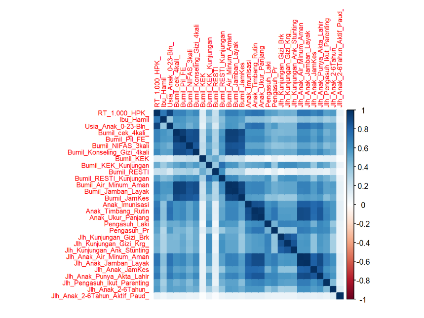

  

# 🍓 DATA SCIENCE CHALLENGE - STATBERRIES 🍓
---
# PREDIKSI RISIKO RENDAHNYA KONVERGENSI IBU ANAK UNTUK PENANGGULANGAN STUNTING
---

[Tentang](#clipboard-Tentang) - [Tujuan dan Fokus](#dart-Tujuan-danFokus) - [Data](#books-Data) - [Diagram Alir](#jigsaw-Diagram-Alir) -[Modeling](#computer-Modeling) - [Evaluasi](#bar_chart-Evaluasi) - [Team](#busts_in_silhouette-Team)

## :clipboard: Tentang
### **Deskripsi Singkat**
Proyek ini bertujuan untuk memprediksi risiko rendahnya konvergensi layanan dasar yang diterima oleh ibu hamil, bayi, dan balita dalam upaya penanggulangan stunting di Indonesia. Konvergensi layanan mencakup intervensi kesehatan, gizi, sanitasi, pendidikan, dan perlindungan sosial yang terintegrasi di tingkat desa. Dengan menggunakan data tingkat desa tahun 2022, proyek ini memodelkan potensi kegagalan konvergensi melalui pendekatan analitik dan visualisasi interaktif. Sistem ini dirancang untuk mendukung pengambilan kebijakan berbasis data, sehingga intervensi dapat diarahkan secara lebih tepat sasaran pada wilayah dan kelompok masyarakat yang paling membutuhkan.

## :dart: Tujuan dan Fokus
### **Tujuan**
Proyek ini bertujuan untuk mengembangkan sistem prediksi risiko rendahnya tingkat konvergensi layanan ibu dan anak di wilayah desa, sebagai bagian dari upaya mendukung kebijakan percepatan penurunan stunting di Indonesia. Sistem ini dirancang agar dapat memberikan gambaran visual dan analisis risiko berbasis data, sehingga mempermudah pemangku kebijakan dalam mengidentifikasi wilayah atau kelompok sasaran yang membutuhkan intervensi prioritas.
### **Fokus**
1. Analisis Data Konvergensi: Mengolah data indikator layanan dasar yang diterima oleh ibu hamil, bayi, dan balita pada tingkat desa.
2. Pemodelan Prediktif: Menggunakan pendekatan machine learning untuk memprediksi risiko rendahnya konvergensi layanan.
3. Visualisasi Interaktif: Menyajikan hasil analisis dalam bentuk visualisasi dashboard HTML yang mudah dipahami.
4. Pendukung Kebijakan: Memberikan output yang aplikatif sebagai bahan pertimbangan dalam perencanaan dan evaluasi program intervensi stunting oleh pemerintah daerah atau pusat.

## :books: Data
### **Sumber Data**
Data yang digunakan dalam proyek ini diperoleh dari portal resmi pemerintah Indonesia, yaitu data.go.id, melalui dataset berjudul **Data Stunting Tahun 2022**. Dataset ini disusun dan dipublikasikan oleh Kementerian Desa, Pembangunan Daerah Tertinggal, dan Transmigrasi Republik Indonesia, sejalan dengan amanat Peraturan Presiden Republik Indonesia Nomor 72 Tahun 2021 tentang Percepatan Penurunan Stunting.  
Sumber data : https://data.go.id/dataset/dataset/data-stunting-2022
### Tahun dan Cakupan
Tahun data : 2022  
Cakupan geografis : Seluruh desa di Indonesia  
Unit observasi : Desa/Kelurahan  
Jumlah observasi : 74305  
Jumlah variabel : 44  

Data ini memuat informasi tahun 2022 pada tingkat desa/kelurahan, yang mencakup:
1. Status penerimaan layanan dasar oleh ibu hamil, bayi, dan balita
2. Indikator akses terhadap fasilitas kesehatan, gizi, dan lingkungan
3. Identifikasi risiko rendahnya konvergensi
Dataset ini menjadi dasar dalam membangun sistem prediktif untuk mengidentifikasi desa-desa dengan risiko konvergensi rendah, guna mendukung target nasional penurunan stunting hingga 14% pada tahun 2024.
### Exploratory Data Analysis (EDA)
Tahapan EDA dilakuka untuk memahami pola distribusi, hubungan antar variabel, serta karakteristik data berdasarkan risiko stunting.  
#### Distribusi Kelas Target stunting_risk
78,87% desa berada dalam kategori risiko **rendah** dan 21,13% desa berada dalam kategori risiko **tinggi**.  
Ketidakseimbangan kelas ini perlu dipertimbangkan dalam pemodelan karena dapat memengaruhi performa model klasifikasi.
#### Boxplot Berdasarkan Risiko
Boxplot per kategori stunting_risk memperlihatkan perbedaan distribusi yang signifikan untuk sejumlah variabel :  
1. Desa risiko **rendah** cenderung memiliki nilai lebih tinggi pada variabel layanan, seperti Anak_Timbang_Rutin, Jlh_Anak_JamKes, dan Anak_Imunisasi
2. Desa risiko **tinggi** menunjukkan lebih banyak nilai rendah atau nol, menunjukkan **kesenjangan layanan**
#### Korelasi Antar Variabel
Heatmap korelasi mengindikasikan adanya korelasi sedang hingga kuat antar indikator layanan dasar yang memiliki jenis layanan serupa, misalnya korelasi positif antara Bumil_cek_4kali dan Bumil_Konseling_Gizi_4kali.  

  

Grafik EDA dapat ditemukan pada folder EDA di repository ini.

## :jigsaw: Diagram Alir

  

## :computer: Modeling

## :bar_chart: Evaluasi

## :busts_in_silhouette: Team

| Nama Lengkap               | NIM           |
|----------------------------|---------------|
| Fani Fahira                | M0501241052   |
| Claudian T. Tangdilomban  | M0501241048   |
| Sabrina Adnin Kamila      | M0501241042   |
| Baiq Nina Febrina         | M0501241063   |
